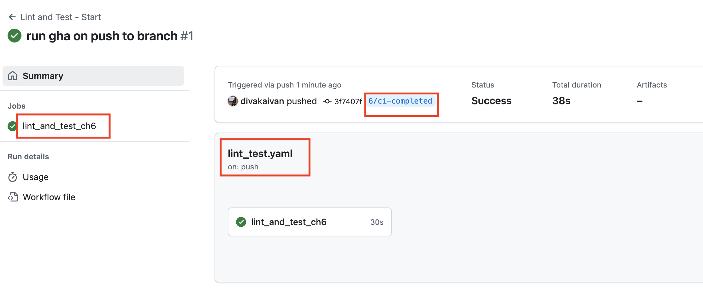

# 6/ci-completed

### Github Actions

I hope you learned at least a little bit about Github Actions and their benefits.

Take a look at my implementation in `.github/workflows/`

You may also notice the following

```yaml
on:
    push:
      branches:
        - 6/ci-completed
```

This tells github that this github action pipeline will be run on any push to the branch with that particular name. If you push this file, go to your Github repo -> Actions (tab at the top), you will see the action running.



### Makefile

You may notice this `make` syntax.

I decided to add a Makefile to make running commands a bit easier. Take a look at the Makefile for more info, and also try running `make` in your terminal.
