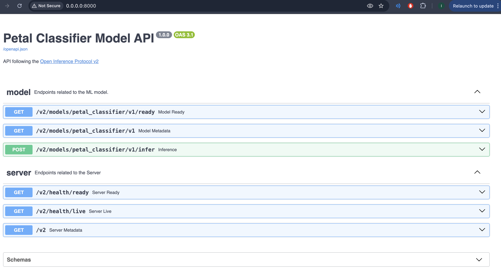

# 3/improve-docs-completed

The things I decided to add are:

- tags
- tags metadata
- made the docs be on the `/` endpoint rather than `/docs`
- added title, description, version

All of these are up to you and what you believe is good for your users. 

This is how my docs look:

