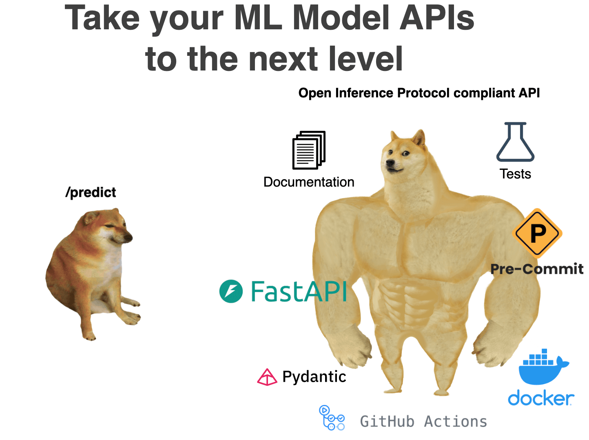
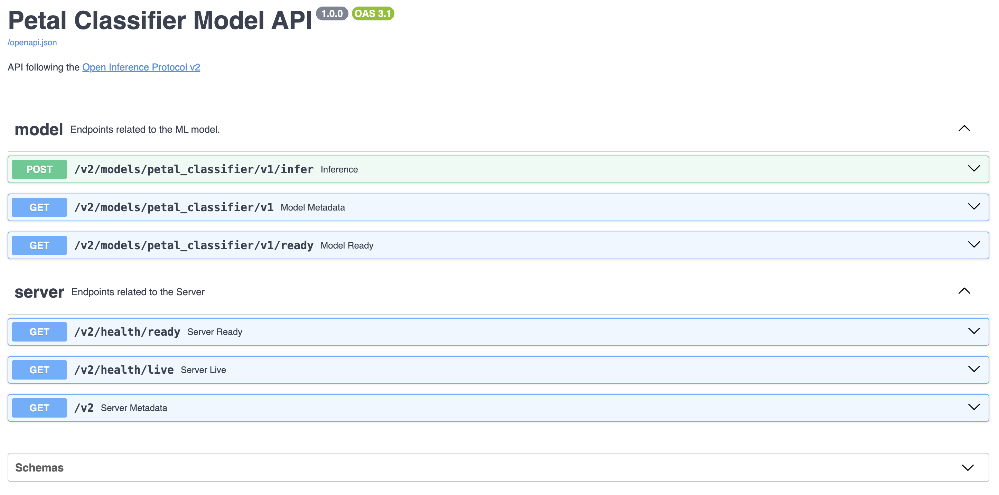

# Take your ML model APIs to the next level

## From `/predict` to the Open Inference Protocol

- design them following the [Open Inference Protocol](https://kserve.github.io/website/latest/modelserving/data_plane/v2_protocol/) — a growing industry standard for standardized, observable, and interoperable machine learning inference
- auto-documentation using FastAPI and Pydantic
- add linting, testing and pre-commit hooks
- build and push an Docker image of the API to Docker Hub
- use Github Actions for automation

## End result

#### HTTP/REST endpoints

| API             | Verb | Path                                                       |
|------------------|------|------------------------------------------------------------|
| Inference        | POST | v2/models/[/versions/<model_version>]/infer               |
| Model Metadata   | GET  | v2/models/<model_name>[/versions/<model_version>]         |
| Server Ready     | GET  | v2/health/ready                                           |
| Server Live      | GET  | v2/health/live                                            |
| Server Metadata  | GET  | v2                                                       |
| Model Ready      | GET  | v2/models/<model_name>[/versions/]/ready                 |

#### API Definitions

| API             | Definition                                                                                                                                                              |
|------------------|--------------------------------------------------------------------------------------------------------------------------------------------------------------------------|
| Inference        | The `/infer` endpoint performs inference on a model. The response is the prediction result.                                                                             |
| Model Metadata   | The "model metadata" API is a per-model endpoint that returns details about the model passed in the path.                                                              |
| Server Ready     | The “server ready” health API indicates if all the models are ready for inferencing. The “server ready” health API can be used directly to implement the Kubernetes readinessProbe. |
| Server Live      | The “server live” health API indicates if the inference server is able to receive and respond to metadata and inference requests. The “server live” API can be used directly to implement the Kubernetes livenessProbe. |
| Server Metadata  | The "server metadata" API returns details describing the server.                                                                                                        |
| Model Ready      | The “model ready” health API indicates if a specific model is ready for inferencing. The model name and (optionally) version must be available in the URL.             |

## Get started

Go to the [`1/setup-start` branch](https://github.com/divakaivan/model-api-oip/tree/1/setup-start) and follow the instructions. For each following branch, the information is in the respective `README.md`

The structure is as follows:

1. Setup
2. Implement Endpoints
3. Improve docs
4. Restructure
5. Add Linting & Tests
6. CI with Github Actions
7. Dockerise and push to Docker Hub

Throughout these above stages I share lots of links to documentation. Some libraries have great docs and thankfully the ones I have used here have amazing docs and explanations. If you learn anything form this repo, I hope it's atleast to get into the habit of looking at the docs of the libraries you use when you need an answer. If you just came here to have a quick look - read the FastAPI docs as a book :)

### Notes

While I think this takes a beginner from just `/predict` and introduces them to some important concepts, I suggest looking into [Eric Riddoch](https://www.linkedin.com/in/eric-riddoch/)'s teaching material: [Taking Python to Production](https://www.udemy.com/course/setting-up-the-linux-terminal-for-software-development/?srsltid=AfmBOoqaXWAasFIZgQFTQA9TTfUUyP5P0hJb6RGd48esUgHeVJ7Xbo5t) and [Cloud Engineering for Python Devs](https://mlops-club.org/).
