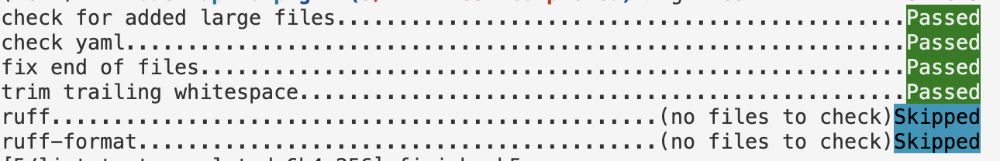

# 5/lint-test-completed

## Tests

You can check the test cases I implemented in the `tests/unit_tests` folder.

To run the tests, run `pytest` from the root project dir in your terminal.

## Linting

I hope you found some cool pre-commit hooks. ruff specifically can not only lint but also format files automatically which is very handy (imo).

To run all the pre-commit hooks manually, you can run `pre-commit run --all-files`. Otherwise they will run automatically when you try to commit new files. If something fails the first time, I suggest you read through the terminal. Most likely it was because of some styling issue that is now fixed. So if you try to `git add ...` and `git commit ...` it might be okay. Bottom line is ~ read the errors in the terminal and what actually happend - pass or fail.

Example:

