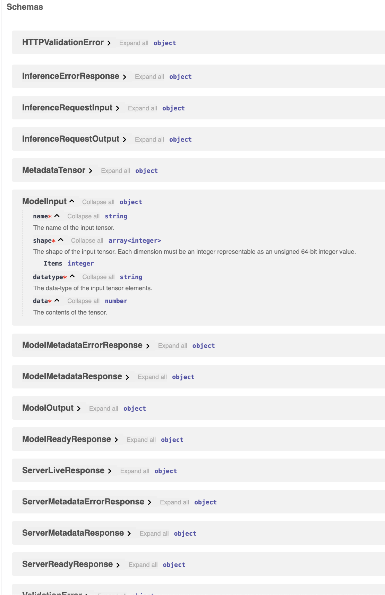

# 2/endpoints-completed

I hope you read some (or quite a bit) of the FastAPI/OIP/Pydantic docs. They are awesome! and definitely suggest to read the FastAPI docs as a mini-book. You will learn a tonne!

If you implemented the endpoints, or switched to the current branch. By running `python main.py` you should see something like


You can try the `/v2/models/petal_classifier/v1/infer` endpoint by passing the below as the request body

```json
{
    "id":"inference-123",
    "inputs":[
        {
            "name":"petal length (cm)",
            "shape":[
                1
            ],
            "datatype":"FP32",
            "data":4.5
        },
        {
            "name":"petal width (cm)",
            "shape":[
                1
            ],
            "datatype":"FP32",
            "data":1.2
        }
    ]
}
```

And all the other endpoints you can directly try as they don't require a request body. 

Because we added descriptions to our `Field`s and endpoints, we can see the docs is populated nicely:



-----------------

There is still left to do for documentation. For instance when you initially went to the `/v2/models/petal_classifier/v1/infer` endpoint, the example request body looked like:

```json
{
  "id": "string",
  "inputs": [
    {
      "name": "string",
      "shape": [
        0
      ],
      "datatype": "string",
      "data": 0
    }
  ]
}
```

This is not very informative of how the endpoint can be used. In the next section `3/improve-docs-start` we will work on that and other small details related to the docs page. 