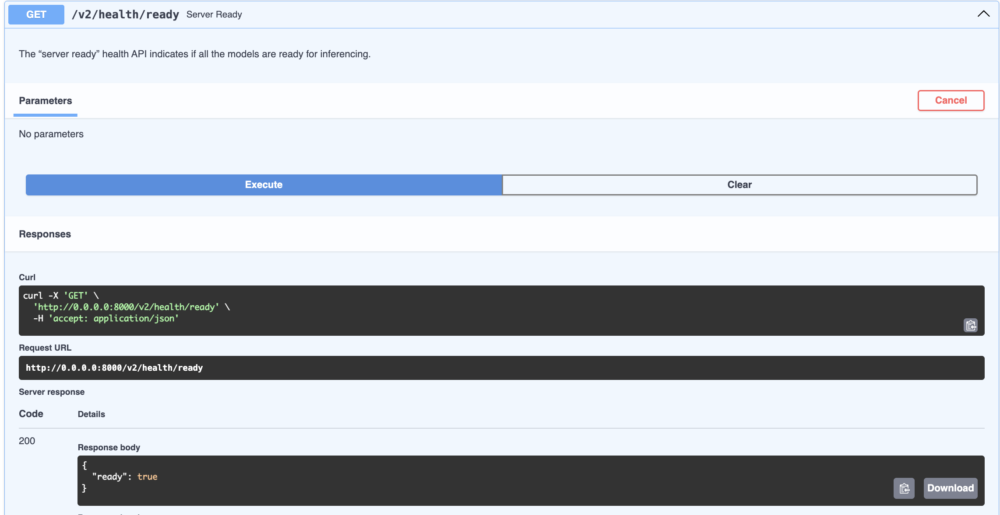
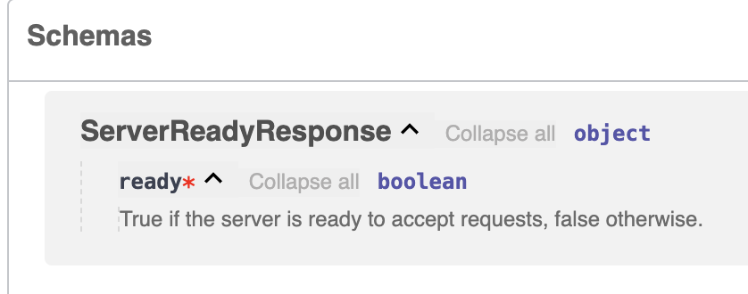

# 2/endpoints-start

## [FastAPI lifespan](https://fastapi.tiangolo.com/advanced/events/#lifespan)

`You can define logic (code) that should be executed before the application starts up. This means that this code will be executed once, before the application starts receiving requests.` - This is from the FastAPI docs and I suggest you read the whole page. For our ML model, are only interested in loading it once - when the API starts. We don't want our model to be loaded every time a user makes a request. To implement this behaviour we use the FastAPI lifespan events. 

In `main.py` I have given you the skeleton for implementing this lifespan logic. In addition to loading the model at the start, we will also load a `model_info.yaml` which will contain static information about our model like input types, name, version. Some of this information might come from model registries (like MLflow) but using tools like MLflow is outside the scope of what I want to show you, so we will mimic it by creating a yaml file with model information. 

## Endpoints

Let's try to follow the [Open Inference Protocol](https://kserve.github.io/website/latest/modelserving/data_plane/v2_protocol/#httprest) (OIP).

We'll start by deleting the `/predict` endpoint and implement the endpoints from the OIP one by one.

First, I will show you an example implementation of the `Server Ready` endpoint, alongside creating Pydantic models for better documentation and type validation. You can check `main.py` for how I implemented the `/v2/health/ready` endpoint and the respective Pydantic model.

If any of the parameters that were passed are not clear, I suggest to search for them in the fastapi or pydantic docs, respectively. The documentation for these two libraries is amazing. 

First I create a ServerReadyResponse object following [the specification from the OIP](https://kserve.github.io/website/latest/modelserving/data_plane/v2_protocol/#server-live-response-json-objet)

```
$live_server_response =
{
  "live" : $bool,
}
```

I implement as:

```python
class ServerReadyResponse(BaseModel):
    ready: bool = Field(
        description="True if the server is ready to accept requests, false otherwise."
    )
```

The Field class comes from pydantic and I use it to add a description to the field. Something that you ought to do and later, these descriptions will become a nice documentation. Where does that description come from? From the OIP docs. Every item has its description and I just copy-pasted it. If you see description in any other part of the code, it's likely it came from the official OIP docs. Ultimately, it's up to you what kind of description you'd like to add. I just felt the official one is the most accurate. 

After that, I created the endpoint as:

```python
@app.get(
    "/v2/health/ready",
    response_model=ServerReadyResponse,
    description="The “server ready” health API indicates if all the models are ready for inferencing.",
)
def server_ready():
    response = ServerReadyResponse(ready=True)
    return JSONResponse(status_code=status.HTTP_200_OK, content=response.model_dump())
```

If you run `python main.py` now (you may need to comment out the code that's not implemented yet), and go to `http://0.0.0.0:8000/docs` you will see the endpoint and be able to query it.



In the image, you can see the endpoint description appearing in the docs. And below, in the Schemas, you can see the ServerReadyResponse type along with its params and description




--------------------

Now, I invite you to try to implement at least some (if not all) the other endpoints following the OIP and the signatures of models and endpoints I have given you. If you ever get stuck, please reference the code in the `2/endpoints-completed` branch. I suggest reading the FastAPI or Pydantic docs if you ever get stuck and don't want to peak at my implementation.
